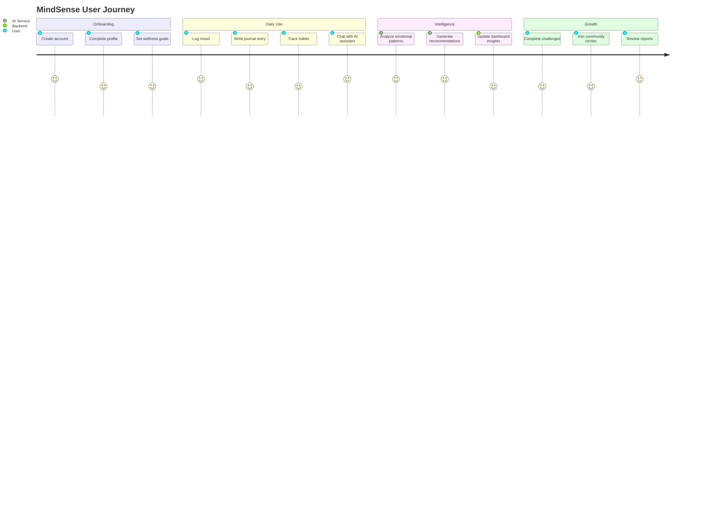
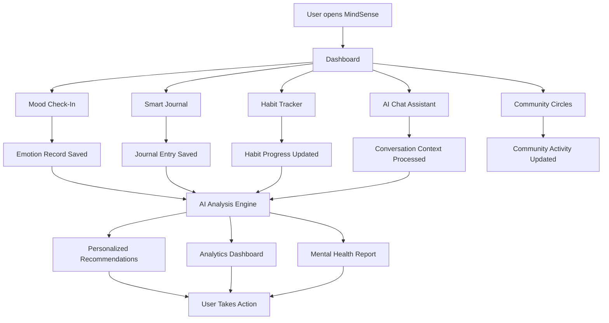
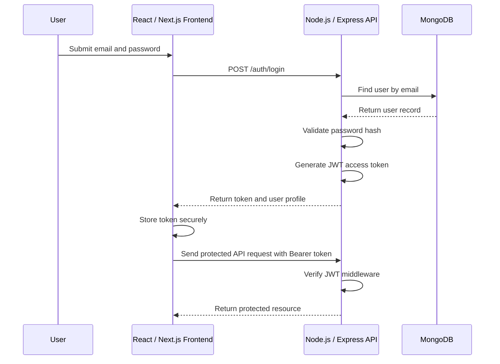
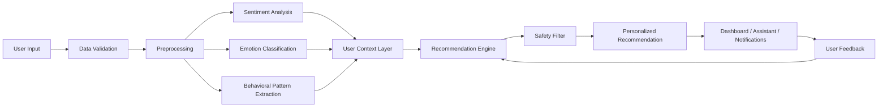

# 🧠 MindSense

## AI-Powered Mental Health & Emotional Wellness Platform

### Track emotions. Understand patterns. Build healthier habits.

**Graduation Project | Class of 2026**

| Role | Name |
|---|---|
| Team Member | **Ammar Yasser Abdelghany Elmihy** |
| Team Member | **Abdelrahman Eslam Mohamed Helal** |
| Team Member | **Ebrahim Ahmed Zaher** |
| Team Member | **Youssef Mohamed Abdelmonem** |
| Team Member | **Amr Hashish** |
| Team Member | **Adel Elshabrawy** |
| Team Member | **Shehab Elsayed** |
| Team Member | **Abdelrahman Zakaria** |
| Team Member | **Shereef Shaheen** |
| Team Member | **Ahmed Talat** |
| Supervisor | **Dr. Amal Abo Eleneen** |
| Teaching Assistant | **Ghada Shafeeq** |

> **MindSense transforms everyday emotional signals into meaningful wellness insights, intelligent recommendations, and supportive human-centered experiences.**

---

## Table of Contents

- [Project Vision](#project-vision)
- [Project Overview](#project-overview)
- [Core Features](#core-features)
- [User Personas](#user-personas)
- [User Stories](#user-stories)
- [System Workflow](#system-workflow)
- [Unique Selling Points](#unique-selling-points)
- [AI Integration](#ai-integration)
- [UI/UX Design Philosophy](#uiux-design-philosophy)
- [Security & Privacy](#security--privacy)
- [Technology Stack](#technology-stack)
- [Screenshot Placeholders](#screenshot-placeholders)
- [Future Roadmap](#future-roadmap)
- [Business Value](#business-value)
- [Team Section](#team-section)

---

# Project Vision

## Why MindSense Exists

Mental health is one of the most important challenges facing students, professionals, families, and communities today. Many people experience emotional pressure, anxiety, burnout, isolation, poor sleep, productivity loss, or difficulty understanding their own behavioral patterns. Yet most people only seek help after the situation becomes serious.

**MindSense exists to make emotional awareness continuous, accessible, and intelligent.**

Instead of treating wellness as a one-time appointment or a crisis-only action, MindSense turns it into a daily companion. It helps users recognize how they feel, understand why they feel that way, discover patterns over time, and receive practical recommendations that support emotional balance.

## The Real-World Problem

Many people struggle with:

| Challenge | Real-World Impact |
|---|---|
| Untracked emotions | Users forget how often certain moods repeat. |
| Delayed support | People often ask for help only after symptoms become severe. |
| Lack of personal insight | Users may not connect mood changes with sleep, habits, workload, or social triggers. |
| Productivity decline | Emotional stress can reduce focus, motivation, and consistency. |
| Social isolation | Users may feel alone even when others face similar struggles. |
| Limited access to specialists | Therapy and counseling may be expensive, unavailable, or stigmatized. |

MindSense addresses these problems by combining **AI analysis**, **habit tracking**, **journaling**, **community support**, and **data-driven wellness reports** into one integrated platform.

## Why Mental Health Technology Matters

Digital wellness platforms can help users take earlier action, build emotional literacy, and receive support in a private and convenient way. With responsible AI and privacy-focused design, technology can make wellness support:

- **More accessible** for users who cannot easily reach professional care.
- **More continuous** through daily check-ins and reminders.
- **More personalized** through AI-powered recommendations.
- **More measurable** through mood analytics and reports.
- **More supportive** through community circles and guided interaction.

> MindSense is not a replacement for professional therapy. It is a supportive intelligent platform that helps users understand themselves better and take healthier daily actions.

---

# Project Overview

## What MindSense Does

MindSense is an AI-powered intelligent mental health and emotional wellness platform that helps users monitor emotional state, analyze mood patterns, receive smart recommendations, build better habits, and connect with supportive communities.

The platform combines a modern user interface with backend services, secure authentication, MongoDB data storage, and AI/ML components that analyze emotional inputs and generate personalized insights.

## Platform Goals

| Goal | Description |
|---|---|
| Emotional awareness | Help users identify and track how they feel over time. |
| Personalized support | Generate recommendations based on mood, behavior, and habits. |
| Early intervention | Detect negative emotional patterns before they become severe. |
| Community connection | Enable safe peer support through circles and group features. |
| Productivity support | Help users manage habits, focus, and daily stability. |
| Professional readiness | Provide a scalable architecture suitable for real-world deployment. |

## Main Workflow

1. **User Registration & Login**
   - User creates an account and securely logs in using JWT authentication.

2. **Initial Emotional Check-In**
   - User records current mood, emotion, note, habit state, or journal entry.

3. **AI Mood Analysis**
   - AI models analyze user input and detect emotional tone, risk patterns, and wellness signals.

4. **Recommendations**
   - The platform provides personalized actions such as breathing exercises, habit reminders, journaling prompts, productivity tips, or community suggestions.

5. **Progress Tracking**
   - User can view reports, charts, streaks, progress history, and emotional trends.

6. **Community & Support**
   - User may join community circles, participate in challenges, or connect with professional support options.

## User Journey

| Stage | User Action | System Response |
|---|---|---|
| Onboarding | Creates account and profile | Builds secure identity and preference profile |
| Daily Check-In | Logs mood, journal, or habit data | Stores emotional and behavioral data |
| AI Analysis | Submits text, voice, or emotional input | Detects sentiment, emotion, and patterns |
| Recommendation | Views suggested actions | Receives personalized wellness guidance |
| Reflection | Reviews dashboard and reports | Understands progress and recurring triggers |
| Connection | Joins circles or sessions | Builds supportive social wellness network |
| Growth | Completes habits and challenges | Gains motivation through progress and gamification |

---

# Core Features

## 1. AI Mood Analysis

### Purpose

AI Mood Analysis helps MindSense understand the user's emotional state from check-ins, journal entries, self-reported moods, and optional multimodal signals such as voice tone or facial expression analysis.

### User Benefit

- Helps users understand emotions that may be difficult to describe.
- Detects recurring mood changes and emotional triggers.
- Supports earlier awareness before stress becomes overwhelming.
- Creates a more personalized wellness experience.

### Workflow

1. User submits a mood check-in, journal entry, or emotional input.
2. The frontend sends the data to the backend through a secure REST API.
3. The backend validates the request and forwards relevant input to the AI service.
4. AI models classify emotional tone, confidence score, sentiment, and possible trigger patterns.
5. Results are stored in MongoDB and displayed in the analytics dashboard.

### Technical Explanation

MindSense can use NLP sentiment analysis, emotion classification models, and behavioral feature extraction. The backend exposes REST endpoints for emotion records, while the AI layer processes input and returns structured output such as:

| Field | Example |
|---|---|
| Primary emotion | Anxious |
| Sentiment score | -0.62 |
| Confidence | 91% |
| Trigger candidates | Exams, lack of sleep, workload |
| Suggested intervention | Guided breathing and schedule break |

### Future Enhancement

- Add multimodal emotion fusion using facial expression, voice tone, text sentiment, and behavioral signals.
- Build personalized emotional baselines for each user.
- Detect long-term risk patterns and recommend professional support when needed.

---

## 2. Emotion Tracking

### Purpose

Emotion Tracking allows users to log daily feelings and monitor how their emotional state changes across days, weeks, and months.

### User Benefit

- Makes emotions visible and measurable.
- Helps users identify repeated emotional cycles.
- Supports self-reflection and personal growth.
- Encourages consistent wellness habits.

### Workflow

1. User selects or enters an emotion.
2. User optionally adds intensity, note, context, tags, or trigger.
3. System saves the entry in the user's emotional history.
4. Dashboard visualizes trends using charts and summaries.
5. AI uses history to improve future recommendations.

### Technical Explanation

Emotion entries can be modeled as MongoDB documents linked to the user ID. Each entry may contain emotion label, intensity, timestamp, tags, notes, and AI-generated metadata. REST APIs allow creating, reading, filtering, and aggregating emotional history.

### Future Enhancement

- Add calendar heatmaps.
- Support wearable device integrations.
- Add location-aware or event-aware trigger detection with user consent.

---

## 3. Smart Journal

### Purpose

The Smart Journal provides a private space for users to write thoughts, reflect on emotions, and receive AI-generated insights.

### User Benefit

- Encourages emotional expression.
- Helps users understand thought patterns.
- Provides prompts when users do not know what to write.
- Turns journaling into structured self-reflection.

### Workflow

1. User writes a journal entry.
2. AI analyzes sentiment, themes, emotional intensity, and repeated keywords.
3. System generates a short reflection summary.
4. User receives optional prompts or recommendations.
5. Journal history becomes part of the user's wellness timeline.

### Technical Explanation

Journal text is processed by NLP pipelines for sentiment analysis, topic extraction, emotional tone detection, and recommendation generation. Secure APIs protect journal data and allow only authenticated users to access their own entries.

### Future Enhancement

- Add voice-to-journal transcription.
- Generate weekly journal reflection summaries.
- Add AI-guided cognitive reframing prompts.

---

## 4. Habit Tracking

### Purpose

Habit Tracking helps users monitor behaviors that influence emotional wellness, such as sleep, exercise, hydration, study time, screen time, meditation, and social activity.

### User Benefit

- Connects habits with mood changes.
- Supports consistency and self-discipline.
- Helps users discover which behaviors improve emotional stability.
- Provides motivational progress tracking.

### Workflow

1. User creates a habit.
2. User logs habit completion daily.
3. System tracks streaks, consistency, and missed days.
4. AI compares habit data with mood history.
5. Dashboard displays correlations and progress.

### Technical Explanation

Habits are stored as user-linked records with frequency, target days, completion logs, and status. Backend services aggregate habit completion rates and compare them with emotional trends using analytics queries.

### Future Enhancement

- Predict which habits are most likely to improve user mood.
- Add adaptive habit suggestions.
- Integrate with phone health apps and wearable APIs.

---

## 5. AI Chat Assistant

### Purpose

The AI Chat Assistant acts as a supportive conversational companion that helps users reflect, organize thoughts, and receive wellness suggestions.

### User Benefit

- Offers immediate support when the user needs to talk.
- Provides personalized coping strategies.
- Encourages reflection without judgment.
- Can guide users toward professional resources when necessary.

### Workflow

1. User opens the AI assistant.
2. User sends a message about mood, stress, habits, or daily events.
3. Assistant uses user context and safety rules to generate a helpful response.
4. If risk indicators appear, the system recommends urgent support resources.
5. Conversation summaries may be used to improve recommendations with user permission.

### Technical Explanation

The assistant can integrate with a language model service, safety filters, context builders, memory modules, and recommendation engines. Backend services manage message storage, session context, user limits, and privacy rules.

### Future Enhancement

- Add multilingual emotional support.
- Add voice-based AI companion sessions.
- Add counselor handoff workflows for high-risk cases.

---

## 6. Community Circles

### Purpose

Community Circles allow users to join supportive groups based on shared experiences, goals, or wellness topics.

### User Benefit

- Reduces feelings of isolation.
- Encourages peer motivation and shared progress.
- Creates a safe space for emotional support.
- Supports group-based challenges and discussions.

### Workflow

1. User browses available community circles.
2. User joins a circle aligned with interests or emotional goals.
3. User can post, comment, react, participate in discussions, or join group sessions.
4. Moderation tools protect the community environment.
5. Notifications keep users updated about relevant activity.

### Technical Explanation

Community features can be built using Express routes, MongoDB models for posts, comments, circles, reports, moderation actions, and real-time communication through sockets or event-driven services.

### Future Enhancement

- Add AI-assisted moderation.
- Add expert-led community sessions.
- Add anonymous support mode with strict safety controls.

---

## 7. Mental Health Reports

### Purpose

Mental Health Reports summarize mood trends, habit consistency, journal insights, emotional triggers, and improvement areas.

### User Benefit

- Helps users understand progress clearly.
- Converts raw data into meaningful insight.
- Makes it easier to share summaries with counselors if the user chooses.
- Encourages accountability and long-term reflection.

### Workflow

1. System aggregates mood, journal, habit, and activity data.
2. AI identifies patterns and repeated emotional triggers.
3. Dashboard displays charts, summaries, and recommendation cards.
4. User can export or review historical reports.

### Technical Explanation

Reports are generated through backend analytics services that query MongoDB, calculate statistics, and optionally enrich the results with AI summaries. Data can be grouped by week, month, mood category, or habit type.

### Future Enhancement

- PDF report export.
- Counselor-friendly report format.
- Predictive wellness score with explainable factors.

---

## 8. Notifications & Reminders

### Purpose

Notifications help users maintain healthy routines by reminding them to check in, journal, complete habits, attend sessions, or practice wellness exercises.

### User Benefit

- Builds consistency.
- Reduces missed habits and forgotten check-ins.
- Keeps users engaged without overwhelming them.
- Supports personalized wellness routines.

### Workflow

1. User configures reminder preferences.
2. System schedules reminders based on user settings.
3. Notification is triggered at the right time.
4. User completes the action from the platform.
5. Completion updates streaks and analytics.

### Technical Explanation

The backend can manage notification records, scheduling logic, read/unread states, and user preferences. APIs expose notifications to the frontend, and future versions can support email, push notifications, or SMS integrations.

### Future Enhancement

- Smart reminder timing based on user behavior.
- Push notifications for mobile apps.
- AI-generated motivational reminders.

---

## 9. Gamification System

### Purpose

The Gamification System motivates users through streaks, badges, challenges, leaderboards, and progress milestones.

### User Benefit

- Makes wellness habits more engaging.
- Encourages long-term consistency.
- Rewards positive behaviors.
- Supports friendly community participation.

### Workflow

1. User completes a habit, check-in, challenge, or wellness activity.
2. System updates points, streaks, badges, or challenge progress.
3. User sees progress feedback in the dashboard.
4. Community challenges create shared motivation.

### Technical Explanation

Gamification can be implemented using challenge models, participation records, badge rules, reward services, and leaderboard APIs. Backend services calculate progress and award achievements based on defined rules.

### Future Enhancement

- Adaptive challenges based on user goals.
- Seasonal wellness events.
- AI-personalized challenge suggestions.

---

## 10. User Profiles

### Purpose

User Profiles store personal preferences, wellness goals, profile information, subscription state, privacy settings, and personalization data.

### User Benefit

- Makes the platform feel personalized.
- Allows users to manage identity and preferences.
- Supports customized recommendations.
- Gives users control over privacy and account settings.

### Workflow

1. User creates or updates profile data.
2. Backend validates and stores profile changes.
3. Platform personalizes dashboard, notifications, and recommendations.
4. User can manage account settings and privacy options.

### Technical Explanation

Profiles are stored in MongoDB and protected by JWT-based authorization. Profile images can be handled through upload middleware, while user preferences drive personalization logic across the application.

### Future Enhancement

- Wellness goal templates.
- Personal AI preference settings.
- More advanced privacy control center.

---

## 11. Analytics Dashboard

### Purpose

The Analytics Dashboard gives users a visual overview of emotional history, habits, community activity, recommendations, and wellness progress.

### User Benefit

- Turns complex wellness data into simple visuals.
- Helps users track progress at a glance.
- Highlights patterns that may otherwise be missed.
- Supports better decision-making and self-care.

### Workflow

1. User opens dashboard.
2. Frontend requests analytics data from backend APIs.
3. Backend aggregates mood, habit, journal, and engagement records.
4. Dashboard renders charts, summaries, recommendations, and alerts.
5. User acts on insights through check-ins, habits, or AI assistant.

### Technical Explanation

The dashboard can be built with React components, chart libraries, REST API calls, state management, and aggregation endpoints. MongoDB aggregation pipelines can calculate trends, counts, averages, and correlations.

### Future Enhancement

- Real-time analytics updates.
- Custom dashboard widgets.
- Predictive insights and personalized wellness scoring.

---

# User Personas

## Persona 1: University Student

| Attribute | Details |
|---|---|
| Name | Sara Ahmed |
| Age | 21 |
| Background | Computer science student balancing exams, projects, and social pressure |
| Goals | Reduce exam stress, improve sleep, stay motivated, understand mood swings |
| Pain Points | Anxiety before deadlines, inconsistent sleep, limited time for therapy |
| MindSense Value | Tracks stress patterns, provides study-break recommendations, supports journaling and habit consistency |

**Scenario:** Sara uses MindSense during exam season. She logs her mood daily, writes short journal entries, and notices that her anxiety increases after poor sleep. MindSense recommends sleep reminders, breathing exercises, and focused study blocks.

## Persona 2: Working Professional

| Attribute | Details |
|---|---|
| Name | Omar Hassan |
| Age | 29 |
| Background | Software engineer working long hours in a high-pressure environment |
| Goals | Prevent burnout, improve productivity, manage work stress |
| Pain Points | Mental fatigue, irregular breaks, high workload, difficulty disconnecting |
| MindSense Value | Detects stress patterns, recommends breaks, tracks habits, summarizes emotional trends |

**Scenario:** Omar checks in after work and notices repeated stress spikes on days with long meetings. MindSense recommends calendar-aware breaks, breathing exercises, and end-of-day reflection prompts.

## Persona 3: Therapist / Counselor

| Attribute | Details |
|---|---|
| Name | Dr. Laila Mostafa |
| Age | 38 |
| Background | Counselor supporting young adults and university students |
| Goals | Understand client patterns between sessions, encourage self-reflection |
| Pain Points | Limited session time, incomplete user recall, lack of structured progress data |
| MindSense Value | Gives users structured reports they can choose to share, improving session quality |

**Scenario:** A client shares a MindSense weekly report with Dr. Laila. The report shows mood dips linked to sleep disruption and social isolation, helping the session focus on practical interventions.

---

# User Stories

| ID | User Story | Priority |
|---|---|---|
| US-01 | As a user, I want to create an account so that I can securely save my wellness data. | High |
| US-02 | As a user, I want to log in with protected authentication so that my private information remains secure. | High |
| US-03 | As a user, I want to record my current mood so that I can track emotional changes over time. | High |
| US-04 | As a user, I want to add notes to my mood entries so that I can remember what caused my emotions. | High |
| US-05 | As a user, I want AI to analyze my journal entries so that I can better understand my emotional tone. | High |
| US-06 | As a user, I want personalized recommendations so that I know what actions may improve my wellbeing. | High |
| US-07 | As a user, I want to track habits like sleep and exercise so that I can understand how they affect my mood. | High |
| US-08 | As a user, I want to view charts of my mood history so that I can identify trends visually. | High |
| US-09 | As a user, I want weekly mental health reports so that I can review my progress. | Medium |
| US-10 | As a user, I want reminder notifications so that I do not forget daily check-ins or habits. | Medium |
| US-11 | As a user, I want to chat with an AI assistant so that I can reflect when I feel stressed or overwhelmed. | High |
| US-12 | As a user, I want safety-aware AI responses so that I receive responsible support during difficult moments. | High |
| US-13 | As a user, I want to join community circles so that I can connect with people who share similar wellness goals. | Medium |
| US-14 | As a user, I want to post anonymously in selected support spaces so that I can express myself safely. | Medium |
| US-15 | As a user, I want to complete challenges so that wellness routines feel more motivating. | Low |
| US-16 | As a user, I want to earn badges and streaks so that I stay encouraged to continue healthy habits. | Low |
| US-17 | As a therapist, I want users to export wellness summaries so that sessions can be more focused and informed. | Medium |
| US-18 | As an admin, I want to moderate community content so that the platform remains safe and respectful. | High |
| US-19 | As a user, I want to update my profile and preferences so that the platform matches my personal needs. | Medium |
| US-20 | As a user, I want to control privacy settings so that I decide what data is stored or shared. | High |
| US-21 | As a user, I want AI to identify emotional triggers so that I can avoid or manage recurring stressors. | High |
| US-22 | As a user, I want responsive design so that I can use MindSense from desktop, tablet, or mobile. | Medium |
| US-23 | As a user, I want accessible UI elements so that the platform is comfortable for different abilities and needs. | Medium |
| US-24 | As a user, I want secure password reset so that I can recover access safely. | High |
| US-25 | As a user, I want recommendation history so that I can see which suggestions helped me most. | Low |

---

# System Workflow

## User Journey Diagram

## Feature Workflow Diagram

## Authentication Flow

## AI Recommendation Pipeline

---

# Unique Selling Points

| Unique Value | Explanation |
|---|---|
| AI-powered personalization | Recommendations are based on emotional data, behavior, habits, and personal history. |
| Complete wellness ecosystem | Combines mood tracking, journaling, habits, AI chat, reports, and community in one platform. |
| Human-centered design | Focuses on emotional comfort, safety, privacy, and accessibility. |
| Community support layer | Encourages users to grow through shared challenges and safe circles. |
| Practical analytics | Converts emotional data into visual trends, reports, and actionable insights. |
| Scalable architecture | Built with modern frontend, backend, database, and AI service separation. |
| Graduation-project strength | Demonstrates full-stack engineering, AI integration, security, UX, and business potential. |

---

# AI Integration

## Sentiment Analysis

MindSense uses sentiment analysis to determine whether a user's journal entry, message, or check-in expresses positive, neutral, or negative emotional tone. Sentiment scores help the platform understand emotional direction and intensity.

### Example Output

| Input Type | AI Result |
|---|---|
| Journal text | Negative sentiment, high stress intensity |
| Mood note | Mild anxiety, low confidence |
| Chat message | Sadness indicators, social isolation theme |

## Recommendation Engine

The recommendation engine transforms AI analysis into practical wellness actions. It considers:

- Current emotional state.
- Mood history.
- Habit consistency.
- Previous recommendation feedback.
- Time of day and user preferences.
- Safety and risk indicators.

### Recommendation Types

| Type | Example |
|---|---|
| Immediate support | "Try a 2-minute breathing exercise." |
| Habit improvement | "Sleep was low this week. Set a bedtime reminder." |
| Productivity | "Break your study session into 25-minute focus blocks." |
| Reflection | "Write about what triggered today's stress." |
| Community | "Join a student stress support circle." |

## Behavioral Analysis

Behavioral analysis compares mood data with habits, activity, journaling patterns, and engagement signals. This helps MindSense identify relationships such as:

- Mood drops after poor sleep.
- Increased stress during exam periods.
- Better emotional stability on days with exercise.
- Reduced anxiety after consistent journaling.
- Social isolation patterns when community activity decreases.

## Predictive Insights

Predictive insights estimate possible future emotional states based on historical patterns. For example, if the system detects that a user often reports stress after multiple missed sleep goals, it can recommend preventive action before the pattern repeats.

> Predictive features should always be explainable, privacy-focused, and supportive rather than alarming.

---

# UI/UX Design Philosophy

## Design Principles

| Principle | Description |
|---|---|
| Emotional comfort | The interface should feel calm, supportive, and non-judgmental. |
| Minimal design | Screens should be clean, focused, and free from unnecessary complexity. |
| Accessibility | Colors, contrast, typography, and navigation should support diverse users. |
| Responsiveness | The platform should work smoothly across desktop, tablet, and mobile. |
| Trust-first interaction | Users should always understand what data is collected and why. |
| Clear feedback | Every user action should provide helpful visual or textual response. |

## Accessibility

MindSense should support accessible interaction through:

- Clear typography and readable spacing.
- Strong color contrast for important states.
- Keyboard-friendly navigation.
- Alternative text for meaningful images.
- Avoiding overwhelming animations.
- Simple language for sensitive emotional content.

## Emotional Comfort

The platform should avoid harsh alerts, judgmental language, or visually stressful layouts. Instead, MindSense should use calm visual hierarchy, reassuring microcopy, supportive empty states, and clear recovery paths when users feel stuck.

## Responsive Experience

Users may check in quickly from a phone, review reports from a laptop, or chat with the assistant on a tablet. The layout should adapt naturally, with dashboards, forms, charts, and community content remaining easy to use at every screen size.

---

# Security & Privacy

Mental health data is sensitive. MindSense must treat privacy and security as core product features, not optional technical details.

## Security Measures

| Area | Implementation |
|---|---|
| Authentication | JWT-based login and protected routes |
| Passwords | Secure password hashing before database storage |
| API Security | Middleware validation, route protection, and request sanitization |
| Authorization | User-specific access control for private resources |
| Data Protection | Encryption-ready architecture for sensitive fields |
| Upload Security | Controlled file upload middleware and validation |
| Environment Secrets | API keys and secrets stored in environment variables |
| Error Handling | Safe error responses without leaking internal system data |

## JWT Authentication

JWT authentication enables stateless secure sessions. After login, the backend signs a token that is sent with protected requests. Middleware verifies the token before allowing access to private resources such as user profile, mood history, journal entries, reports, and community actions.

## Encryption

MindSense can apply encryption for sensitive data at rest and secure HTTPS communication in production. Passwords must be hashed, never stored in plain text. Tokens, API keys, and secrets must remain outside the codebase.

## Privacy Protection

MindSense should provide:

- Clear privacy settings.
- User control over shared data.
- Private-by-default mental health records.
- Optional export and deletion options.
- Minimal data collection.
- Responsible AI usage policies.

---

# Technology Stack

## Frontend Stack

| Technology | Purpose |
|---|---|
| Next.js / React | Interactive frontend application and component-based UI |
| JavaScript / TypeScript | Application logic and maintainable frontend code |
| CSS Modules / Tailwind / Custom CSS | Responsive styling and design system |
| Axios / Fetch | API communication |
| Charting Library | Mood analytics and dashboard visualizations |
| State Management | Authentication, user state, mood data, and UI state |

## Backend Stack

| Technology | Purpose |
|---|---|
| Node.js | Backend runtime |
| Express.js | REST API framework |
| MongoDB | Document database for users, emotions, habits, reports, and community data |
| Mongoose | Schema modeling and database operations |
| JWT | Secure authentication and protected routes |
| Middleware Layer | Validation, authentication, upload handling, and authorization |
| REST APIs | Communication contract between frontend, backend, and AI services |

## AI / ML Stack

| Technology | Purpose |
|---|---|
| Python | AI and machine learning service development |
| FastAPI | AI inference service APIs |
| NLP Models | Sentiment analysis, emotion detection, and recommendation support |
| ML Pipelines | Preprocessing, classification, confidence scoring, and pattern detection |
| Recommendation Engine | Personalized wellness suggestions |
| Safety Filters | Responsible handling of sensitive emotional conversations |

## Infrastructure & DevOps

| Technology | Purpose |
|---|---|
| Docker | Containerized service deployment |
| Docker Compose | Multi-service orchestration |
| Environment Variables | Secure configuration management |
| GitHub | Version control and collaboration |
| API Documentation | Developer-friendly endpoint clarity |
| Logging | Debugging, monitoring, and operational visibility |

## Architecture Summary

| Layer | Responsibility |
|---|---|
| Presentation Layer | React/Next.js UI, dashboards, forms, community screens |
| API Layer | Express REST endpoints, authentication, validation |
| Data Layer | MongoDB collections and schemas |
| Intelligence Layer | AI analysis, recommendation engine, safety logic |
| Experience Layer | Notifications, gamification, reports, community interaction |

---

# Screenshot Placeholders

Use the following image paths for GitHub and PDF export once screenshots are added to the `images/` directory.

---

# Future Roadmap

## Version 1: Core Wellness Platform

| Feature | Description |
|---|---|
| Authentication | Secure registration, login, JWT sessions, and profile management |
| Mood Tracking | Daily emotion logging with notes and intensity |
| Smart Journal | Private journal entries with basic AI sentiment analysis |
| Dashboard | Visual emotional history and habit summaries |
| AI Recommendations | Personalized wellness tips based on user data |
| Community Circles | Basic groups, posts, comments, and support interaction |

## Version 2: Advanced Personalization

| Feature | Description |
|---|---|
| Behavioral Analytics | Correlate mood with sleep, habits, routines, and engagement |
| Smart Notifications | Personalized reminders based on user behavior |
| Mental Health Reports | Weekly and monthly reports with AI summaries |
| Gamification | Badges, streaks, challenges, and leaderboards |
| Professional Marketplace | Connect users with therapists, counselors, or coaches |
| Export Options | PDF wellness reports for personal or counseling use |

## Version 3: Ecosystem Expansion

| Feature | Description |
|---|---|
| Mobile Application | Native mobile experience for Android and iOS |
| Wearable Integration | Import sleep, heart rate, activity, and stress signals |
| Voice Companion | Voice-based emotional support and reflective conversation |
| Group Sessions | Scheduled community or professional-led support sessions |
| Enterprise Wellness | Team wellbeing dashboards for schools and organizations |
| Multi-language Support | Accessible wellness support in multiple languages |

## AI Future Expansion

| AI Capability | Description |
|---|---|
| Multimodal Emotion Recognition | Combine text, voice, facial expression, and behavior signals |
| Predictive Risk Detection | Identify possible emotional decline before it becomes severe |
| Explainable Recommendations | Show users why a recommendation was generated |
| Personalized AI Coach | Long-term assistant adapted to user goals and communication style |
| Counselor Support Tools | Optional therapist-facing summaries with user consent |
| Crisis-Aware Safety Layer | Detect high-risk language and guide users to urgent support resources |

---

# Business Value

## Educational Impact

MindSense is a strong graduation project because it demonstrates:

- Full-stack software engineering.
- AI/ML integration.
- REST API design.
- Secure authentication.
- Database modeling.
- Responsive UI/UX.
- Real-world problem solving.
- Ethical technology considerations.

## Social Impact

MindSense can support users who may not have immediate access to mental health resources. By encouraging emotional awareness, habit consistency, and community connection, the platform can help reduce isolation and promote healthier daily behavior.

## Healthcare Potential

MindSense can become a supportive layer between daily life and professional care. With user consent, reports and emotional trends can help therapists understand what happens between sessions, making support more data-informed and personalized.

## Commercial Scalability

| Market Opportunity | Potential Value |
|---|---|
| Students | University wellness programs and exam stress support |
| Professionals | Burnout prevention and workplace wellbeing |
| Therapists | Client reflection tools and progress summaries |
| Organizations | Scalable emotional wellness programs |
| Mobile Users | Subscription-based personal wellness assistant |

## Potential Business Models

| Model | Description |
|---|---|
| Freemium | Free core tracking with premium AI reports and advanced analytics |
| Subscription | Monthly access to advanced assistant, reports, and personalized plans |
| B2B Education | University licensing for student wellness programs |
| B2B Corporate | Employee wellness and productivity support |
| Professional Marketplace | Commission or booking fees for counselor sessions |

---

# Team Section

## Project Team

| Name | Role |
|---|---|
| **Ammar Yasser Abdelghany Elmihy** | Graduation Project Team Member |
| **Abdelrahman Eslam Mohamed Helal** | Graduation Project Team Member |
| **Ebrahim Ahmed Zaher** | Graduation Project Team Member |

## Academic Supervision

| Name | Role |
|---|---|
| **Dr. Amal Abo Eleneen** | Project Supervisor |
| **Ghada Shafeeq** | Teaching Assistant |

---

# Closing Statement

MindSense is more than a mental health tracking application. It is a complete intelligent wellness ecosystem designed to help users understand themselves, build healthier habits, connect with supportive communities, and receive AI-powered guidance in a secure and emotionally comfortable environment.

By combining modern full-stack development, AI-driven analysis, privacy-aware architecture, and human-centered design, MindSense represents a powerful graduation project with real educational, social, healthcare, and commercial potential.

## MindSense

### A smarter path to emotional awareness, wellness, and growth.

